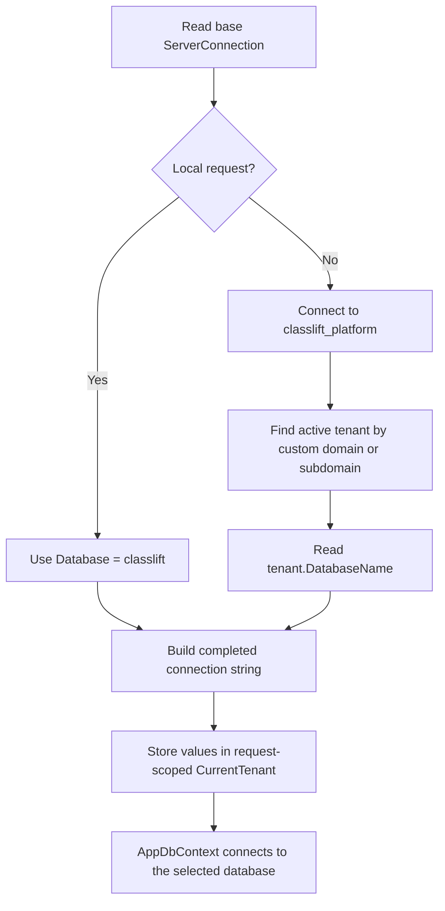

# Tenant Connection Strings

This guide explains how ClassLift chooses a database for each request and for background jobs. It is intended for developers who are new to the project and for maintainers who need to change the tenancy rules safely.

## Quick summary

ClassLift uses a database-per-tenant design:

- One base connection string contains the MySQL server address and credentials.
- The central `classlift_platform` database contains the production tenant registry.
- Every production tenant has its own database name in `tenantregistry`.
- Local development skips `tenantregistry` and always uses the `classlift` database.
- `AppDbContext` receives the completed tenant connection string through a scoped `CurrentTenant` object.

Only the database name changes. The server, port, username, password, and other MySQL settings come from the base `ServerConnection` configuration.



## Important files

| File | Responsibility |
| --- | --- |
| `Web/Program.cs` | Reads the base connection string and registers both database contexts. |
| `Core/Services/TenantConnectionStringFactory.cs` | Adds a database name to the base connection string. |
| `Core/Middleware/TenantResolutionMiddleware.cs` | Selects the tenant for each HTTP request. |
| `Core/Models/CurrentTenant.cs` | Carries the resolved tenant values for one dependency-injection scope. |
| `Core/Contexts/BillingDbConext.cs` | Connects to `classlift_platform` and exposes `tenantregistry`. |
| `Core/Contexts/AppDbContext.cs` | Connects to the selected local or tenant application database. |
| `Core/BackendService/TenantStatusUpdater.cs` | Selects databases for scheduled status updates. |

## 1. Base connection-string configuration

`Program.cs` and `TenantConnectionStringFactory` resolve the base connection string in this order:

1. `ServerConnection`
2. `ConnectionStrings:ServerConnection`

The first form supports the existing Railway variable. The second is the standard ASP.NET Core connection-string key.

### Local development

Store local configuration in `Web/appsettings.Development.json`, or use .NET user secrets. Do not commit a real password.

```json
{
  "ConnectionStrings": {
    "ServerConnection": "Server=localhost;Port=3306;User ID=root;Password=YOUR_LOCAL_PASSWORD;"
  }
}
```

The base string intentionally has no database name. ClassLift adds the correct database later.

Ensure the local launch profile sets:

```text
ASPNETCORE_ENVIRONMENT=Development
```

### Railway

Configure either of these Railway environment variables:

```text
ServerConnection=Server=...;Port=...;User ID=...;Password=...;
```

or, preferably, the standard ASP.NET Core form:

```text
ConnectionStrings__ServerConnection=Server=...;Port=...;User ID=...;Password=...;
```

Double underscores in an environment-variable name map to colons in ASP.NET configuration. Therefore, `ConnectionStrings__ServerConnection` becomes `ConnectionStrings:ServerConnection`.

Railway should normally run with:

```text
ASPNETCORE_ENVIRONMENT=Production
```

Never put the actual Railway connection string in source control or logs.

## 2. Platform database connection

At application startup, `Program.cs` copies the base connection string into a `MySqlConnectionStringBuilder` and assigns:

```csharp
Database = "classlift_platform"
```

The result is registered as `BillingDbContext`. This context is used only for platform data, especially the `tenantregistry` table.

A typical production registry record contains:

```text
OrganizationId: 12
Subdomain: school-one
CustomDomain: portal.school-one.ca
DatabaseName: classlift_school_one
IsActive: true
```

`tenantregistry` stores the database name, not a complete connection string. This avoids storing duplicate MySQL credentials for every tenant.

## 3. HTTP request resolution

`TenantResolutionMiddleware` runs before authentication, authorization, and controller execution. It examines `HttpContext.Request.Host.Host`.

### Local requests

The following are treated as local:

- `localhost`
- `127.0.0.1`

The current middleware does not recognize `::1` or `*.localhost`. Requests using those host forms proceed through non-local resolution and will normally remain unresolved.

For these hosts, the middleware:

1. Does not resolve `BillingDbContext`.
2. Does not query `tenantregistry`.
3. Uses database name `classlift`.
4. Calls `BuildConnectionString("classlift")`.
5. Stores the result in `CurrentTenant`.

These URLs use the local database:

```text
http://localhost:5026
https://localhost:7225
```

### Production and staging requests

For a non-local tenant host, the middleware resolves `BillingDbContext` only after the local check. It then searches active tenants in this order:

1. Exact `CustomDomain` match.
2. ClassLift-managed `Subdomain` match.

For example:

```text
Request: https://school-one.classlift.ca
Extracted subdomain: school-one
Registry database name: classlift_school_one
```

Inactive tenants are ignored. Platform hosts such as `classlift.ca` and `platform.classlift.ca` are not treated as tenant hosts.

If no tenant is found, the current middleware logs a warning and continues. If later code requests `AppDbContext`, it will fail because no tenant was resolved. If the desired behavior changes, the best place to return a tenant-not-found response is this middleware.

## 4. Building the completed connection string

`TenantConnectionStringFactory.BuildConnectionString` uses `MySqlConnectionStringBuilder`:

```csharp
var builder = new MySqlConnectionStringBuilder(baseConnectionString);
builder.Database = databaseName;
return builder.ConnectionString;
```

Conceptually:

```text
Base:
Server=mysql.example;Port=3306;User ID=app;Password=secret;

Selected database:
classlift_school_one

Result:
Server=mysql.example;Port=3306;User ID=app;Password=secret;Database=classlift_school_one;
```

Always use this factory rather than modifying connection strings with string concatenation. The builder handles escaping and replaces an existing database value safely.

## 5. Passing the connection to `AppDbContext`

`CurrentTenant` is registered with scoped lifetime. For an HTTP request, this means each request gets its own instance.

The resolver sets:

```csharp
currentTenant.OrganizationId = ...;
currentTenant.Subdomain = ...;
currentTenant.DatabaseName = ...;
currentTenant.ConnectionString = ...;
```

The local path has no platform organization record, so `OrganizationId` may be null. `CurrentTenant.IsResolved` therefore depends on `DatabaseName` and `ConnectionString`, not `OrganizationId`.

When dependency injection creates `AppDbContext`, its registration in `Program.cs` reads the scoped `CurrentTenant`. It throws if the tenant has not been resolved; otherwise it configures EF Core with `currentTenant.ConnectionString`.

This ordering is essential:

```text
Resolve CurrentTenant values
        before
Resolve AppDbContext or a service/repository that injects AppDbContext
```

Resolving `AppDbContext` first produces:

```text
AppDbContext was requested before the tenant was resolved.
```

## 6. Background status updates

`TenantStatusUpdater` has no HTTP request and therefore has no hostname to inspect. It uses `IHostEnvironment` instead.

### Development behavior in the worker implementation

The updater constructs an in-memory `TenantRegistry` object:

```csharp
var localTenant = new TenantRegistry
{
    OrganizationId = 0,
    DatabaseName = "classlift",
    Subdomain = "localhost",
    IsActive = true
};
```

This object is never inserted into the platform database. It only allows local execution to reuse the existing:

```csharp
ProcessTenantAsync(TenantRegistry tenant, CancellationToken cancellationToken)
```

If the worker is registered in Development, its local branch processes only `classlift` and never calls `LoadActiveTenantsAsync`. However, `Web/Program.cs` currently registers `TenantStatusUpdater` only outside the Development environment, so this branch does not run during normal local startup.

### Production and Railway

The updater calls `LoadActiveTenantsAsync`, queries active registry rows, and passes each row to `ProcessTenantAsync`. Each tenant gets a separate dependency-injection scope, `CurrentTenant`, and `AppDbContext`.

The worker runs once when the application starts and then every ten minutes. Do not also register `ActivityStatusUpdater`, `GroupCourseStatusUpdater`, or `RootCourseStatusUpdater`; those obsolete workers duplicate the operations already consolidated in `TenantStatusUpdater`.

## Safe change recipes

### Change the local database name

The local database name currently appears as `LocalDatabaseName = "classlift"` in two components:

- `TenantResolutionMiddleware` for HTTP requests.
- `TenantStatusUpdater` for background processing.

If the value must change, update both constants together. A future improvement would be to bind one shared `LocalTenantOptions` configuration class so the value has a single source.

### Add another managed production hostname suffix

Update `GetTenantSubdomain` in `TenantResolutionMiddleware`. Keep longer/more-specific suffixes before shorter suffixes and reject multi-level tenant values unless the product intentionally supports them.

Do not add production hostnames to `IsLocalHost`; doing so would bypass the registry and route them to the local database name.

### Change how custom domains work

Modify the exact custom-domain query in `TenantResolutionMiddleware`. Normalize both stored domains and incoming hosts consistently. Do not accept arbitrary database names from headers, query strings, routes, or form values.

### Change the Railway environment-variable name

Update the lookup in both:

- `Web/Program.cs`
- `TenantConnectionStringFactory`

These two locations must resolve the same base connection string. Otherwise `BillingDbContext` and tenant `AppDbContext` may connect to different servers.

### Add a new tenant

1. Create and migrate the tenant database.
2. Insert an active row into `classlift_platform.tenantregistry`.
3. Set its unique `DatabaseName`.
4. Set a managed `Subdomain`, a `CustomDomain`, or both.
5. Confirm the application database user can access the new database.
6. Test tenant resolution and verify that another tenant cannot access its data.

## Troubleshooting

### `ServerConnection is missing`

Check that one of these keys exists in the running process:

```text
ServerConnection
ConnectionStrings:ServerConnection
ConnectionStrings__ServerConnection (environment-variable form)
```

Restart the application after changing Railway variables or local configuration.

### `AppDbContext was requested before the tenant was resolved`

Likely causes:

- The request hostname is neither local nor a recognized tenant hostname.
- No active registry row matched the hostname.
- A service resolves `AppDbContext` before the middleware runs.
- Middleware order changed and `TenantResolutionMiddleware` now runs too late.

Confirm that tenant resolution remains before authentication, authorization, and controller execution.

### Localhost attempts to access `classlift_platform`

For an HTTP request, confirm all of the following:

- The request host is exactly `localhost` or `127.0.0.1`.
- `BillingDbContext` is still resolved lazily after the local branch.

The background updater is not registered during normal Development startup.

### Railway uses the wrong database

Check:

- `ASPNETCORE_ENVIRONMENT` is not `Development`.
- The incoming hostname matches the intended active registry row.
- `DatabaseName` in that row is correct.
- Railway does not define conflicting `ServerConnection` and `ConnectionStrings__ServerConnection` values. Because the top-level `ServerConnection` lookup is first, it wins if both exist.

### MySQL authentication or connectivity failure

Verify the server, port, database-user permissions, TLS requirements, firewall/network access, and whether the configured user can access both `classlift_platform` and the tenant databases. Do not print the completed connection string because it contains the password.

## Security rules

- Never accept a database name directly from an untrusted request.
- Never log a connection string or password.
- Keep production credentials in Railway environment variables or a secret manager.
- Keep local credentials in user secrets or an uncommitted development configuration.
- Use a restricted database user rather than a MySQL administrator account in production.
- Treat tenant-resolution changes as security-sensitive and test cross-tenant isolation.

## Verification checklist

After changing connection-string or tenant-resolution code:

1. Build the application.
2. Start it with `ASPNETCORE_ENVIRONMENT=Development`.
3. Verify `localhost` connects to `classlift` without querying `tenantregistry`.
4. Verify the local background updater processes only `classlift`.
5. Test an active production-style subdomain against a safe environment.
6. Test a custom domain.
7. Test an inactive and unknown tenant.
8. Confirm logs contain the selected database name but no credentials.
9. Confirm two tenants cannot read or update each other's data.

