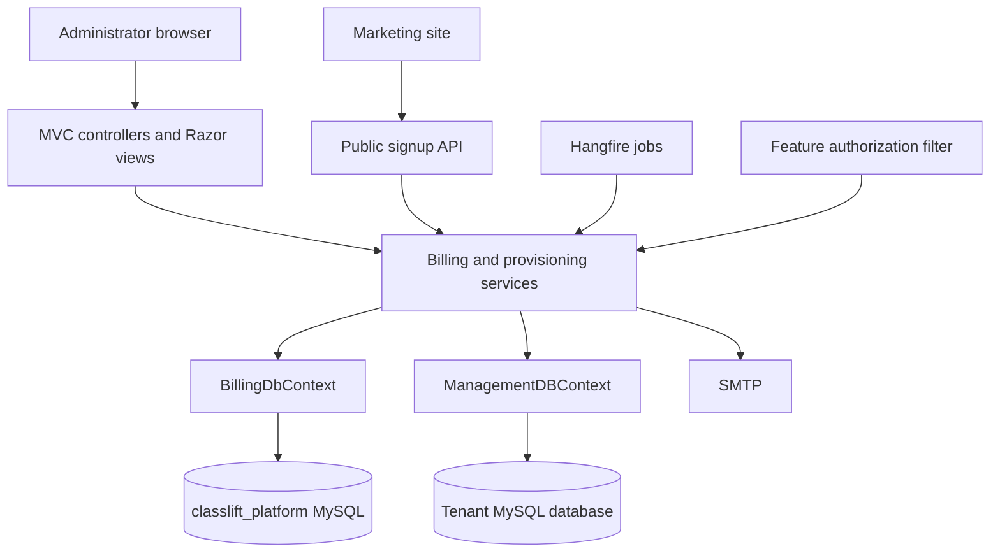
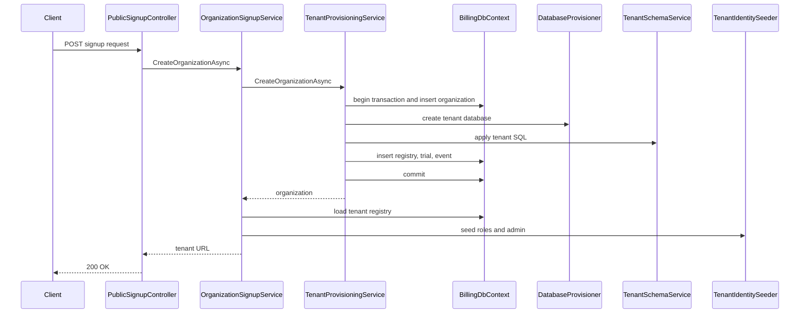
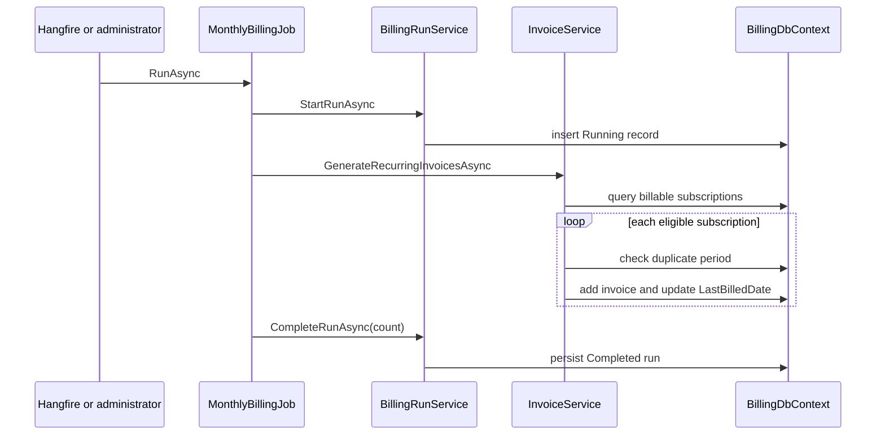

# ClassLift Platform Design Documentation

## 1. Document purpose

This document describes the current code design of ClassLift Platform at three
levels:

1. **Structure level** — projects, folders, runtime layers, data flow, and
   deployment boundaries.
2. **Class level** — the responsibility and collaborators of each significant
   class or class family.
3. **Function level** — the behavior, inputs, results, and side effects of public
   endpoints and service operations.

This is an as-built description of the repository. Planned or empty components
are marked explicitly. Product context and the implementation roadmap live in
[PROJECT.md](PROJECT.md); setup instructions live in [README.md](README.md).

## 2. Design summary

ClassLift Platform is a .NET 8 server-rendered MVC application and central SaaS
management plane. A single management MySQL database stores organizations,
commercial data, ASP.NET Core Identity records, and Hangfire state. Every
organization receives a separate MySQL tenant database containing the ClassLift
operational schema and tenant-specific Identity records.

The application follows a pragmatic layered design:



Controllers currently access `BillingDbContext` directly for straightforward
queries and delegate multi-step domain behavior to services. Services are
registered with scoped lifetimes unless their role calls for another lifetime.

## 3. Structure-level design

### 3.1 Repository structure

```text
classlift_platform/
|-- Billing/                         ASP.NET Core application
|   |-- Configuration/               Strongly typed option objects
|   |-- Constants/                   Domain string constants
|   |-- Controllers/                 MVC and API endpoints
|   |   `-- Public/                  Anonymous public endpoints
|   |-- Data/                        EF Core contexts and mappings
|   |-- Filters/                     Feature-aware authorization
|   |-- Interfaces/                  Provisioning abstractions
|   |-- Migrations/                  Management DB EF migrations
|   |-- Models/                      Persistent entities and API DTOs
|   |-- Pages/                       Residual Razor Pages scaffolding
|   |-- Services/
|   |   |-- Billing/                 Billing domain operations
|   |   |-- Integrations/            Provider extension points
|   |   |-- Jobs/                    Hangfire job entry points
|   |   |-- Notifications/           Email and future notification adapters
|   |   `-- Provisioning/            Tenant lifecycle operations
|   |-- TenantScripts/               Tenant schema source SQL
|   |-- ViewModels/                  MVC screen models
|   |-- Views/                       Razor MVC views
|   |-- wwwroot/                     CSS, JavaScript, and vendor assets
|   `-- Program.cs                   Composition root
|-- Dockerfile                       Multi-stage container build
|-- README.md                        Setup and operating guide
|-- PROJECT.md                       Product/architecture overview and roadmap
`-- classlift_platform.slnx          One-project solution
```

### 3.2 Runtime composition

`Program.cs` performs these operations in order:

1. Creates the web host and binds HTTP to `PORT`, defaulting to `8080`.
2. Adds MVC with a global authenticated-user authorization policy.
3. Configures management Identity using string-keyed `IdentityUser` and
   `IdentityRole` stored in `BillingDbContext`.
4. Constructs the `classlift_platform` connection string from
   `TenantDatabase:*` settings and configures EF Core/MySQL.
5. Registers billing, job, provisioning, caching, and email services.
6. Configures Hangfire to use the management MySQL server.
7. Registers allowed ClassLift origins in the `Classlift` CORS policy.
8. Registers three recurring jobs in the Eastern time zone.
9. Configures `en-CA` localization and the middleware pipeline.
10. Runs `StartupAdminSeeder` before accepting routed requests.
11. Maps the conventional route
    `{controller=Dashboard}/{action=Index}/{id?}`.

HTTPS redirection, Razor Pages mapping, tenant-resolution middleware, and the
Hangfire dashboard are not enabled in the current pipeline.

### 3.3 Dependency injection map

| Contract or type | Implementation | Lifetime | Purpose |
|---|---|---:|---|
| `BillingDbContext` | EF-created context | Scoped | Management data and management Identity |
| `InvoiceService` | Same | Scoped | Trial activation and invoice generation |
| `PaymentService` | Same | Scoped | Full-payment recording |
| `SubscriptionService` | Same | Scoped | Plan transitions and audit events |
| `DunningService` | Same | Scoped | Pending-to-overdue transition |
| `FeatureAccessService` | Same | Scoped | Resolve and cache plan entitlements |
| `BillingRunService` | Same | Scoped | Persist job execution state |
| `IDatabaseProvisioner` | `RailwayDatabaseService` | Scoped | Create/drop MySQL databases |
| `ITenantSchemaService` | `TenantSchemaService` | Scoped | Apply versioned tenant SQL files |
| `ITenantSeedService` | `TenantSeedService` | Scoped | Reserved tenant seed hook |
| `ITenantConnectionStringFactory` | `TenantConnectionFactory` | Scoped | Build server/database connections |
| `ITenantIdentitySeeder` | `TenantIdentitySeeder` | Scoped | Create tenant roles/admin users |
| `IOrganizationSignupService` | `OrganizationSignupService` | Scoped | Public signup orchestration |
| `StartupAdminSeeder` | Same | Scoped | Optional management/tenant startup admins |
| `EmailService` | Same | Transient | SMTP email delivery |
| Hangfire jobs | Job class itself | Scoped | Scheduled application operations |

`IMemoryCache`, `IHttpContextAccessor`, Identity managers, Hangfire, logging,
options, and EF infrastructure are supplied by the framework.

### 3.4 Request and background execution

Authenticated MVC requests follow:

```text
request -> routing -> authentication -> global authorization -> controller
        -> service/context -> MySQL -> Razor view or redirect
```

The public signup controller is decorated with `AllowAnonymous`, bypassing the
global authentication requirement. Hangfire invokes job classes through the DI
container without passing through MVC middleware.

### 3.5 Data ownership and transaction boundaries

- `BillingDbContext` owns central management records and management users.
- `ManagementDBContext` owns tenant users and the tenant application's entities.
- Billing services normally use a scoped EF unit of work and call
  `SaveChangesAsync` within a public operation.
- Subscription changes use an explicit management-database transaction.
- Tenant provisioning wraps management writes in a transaction, but creating a
  MySQL database and applying tenant SQL are external side effects outside that
  transaction's rollback boundary.
- Dates are generally stored in UTC; invoice billing periods use `DateOnly`.

## 4. Class-level design

### 4.1 Configuration and constants

| Class | Responsibility |
|---|---|
| `SmtpSettings` | Binds SMTP host, port, credentials, sender identity, and SSL flag. |
| `StartupAdminOptions` | Binds the opt-in management startup administrator settings. |
| `BillingRunStatus` | Defines billing-run lifecycle strings. |
| `FeatureKeys` | Defines stable feature identifiers used in entitlement checks. |
| `InvoiceStatus` | Defines pending, paid, cancelled, and overdue invoice states. |
| `PaymentMethod` | Defines known payment-method/provider labels. |
| `PaymentStatus` | Defines payment lifecycle strings. |
| `SubscriptionStatus` | Defines trial, active, suspended, cancelled, and expired states. |
| `SubscriptionEventTypes` | Defines subscription audit event strings. |

These constants are strings because the mapped MySQL schema uses string/enum
columns. Application constants and database constraints must remain synchronized.

### 4.2 Data contexts

#### `BillingDbContext`

Extends `IdentityDbContext` for string-keyed management users. It exposes a
`DbSet` for every management entity and defines table names, keys, indexes,
column precision/types, defaults, and relationships in `OnModelCreating`.
Important constraints include unique feature keys, unique plan names, unique
plan-feature pairs, and unique subscription/billing-period invoices.

#### `ManagementDBContext`

Extends `IdentityDbContext<User, IdentityRole<int>, int>` for tenant databases.
It maps the tenant application's integer-keyed Identity model and operational
entities. It is constructed dynamically by `TenantIdentitySeeder` rather than
registered as the application's normal request context.

### 4.3 Persistent domain classes

| Class | Design role and important state |
|---|---|
| `Organization` | Customer account; contact data, current plan pointer, active flag, audit dates, and related commercial records. |
| `Tenantregistry` | Maps an organization to its database, subdomain/custom domain, and active state. |
| `Subscriptionplan` | Reusable commercial offering with per-coach price, minimum monthly charge, active flag, features, and promotions. |
| `OrganizationSubscription` | Time-bounded plan enrollment; trial flags/dates, status, auto-renew flag, billing cursor, and copied prices. |
| `SubscriptionEvent` | Append-style audit event recording old/new plan and status, effective time, actor, and reason. |
| `Feature` | Named entitlement identified by a unique stable feature key. |
| `Planfeature` | Join entity between plan and feature with an `IsLocked` marker. |
| `Invoice` | Subscription charge for a date range; usage snapshot, prices, discounts, total, due date, and status. |
| `Payment` | Provider transaction attached to an invoice with amount, currency, status, date, and notes. |
| `Promotion` | Plan-specific percentage/fixed/override discount definition with effective dates and duration. |
| `BillingRun` | Operational record of a job start/end, status, duration, error, and processed counters. |
| `User` | Integer-keyed tenant Identity user with application role and audit-user fields. |

`PublicSignupRequest` and `OrganizationSignupResult` live under `Models` but are
transport DTOs rather than persisted entities.

### 4.4 View models

| Class | Screen/input represented |
|---|---|
| `BillingDashboardViewModel` / `PlanCountItem` | Revenue, receivables, invoice/subscription counts, and plan distribution. |
| `CreateOrganizationViewModel` | Validated organization, contact, subdomain, plan, and plan selector input. |
| `OrganizationDetailsViewModel` | Organization aggregate display with subscriptions, invoices, payments, tenant, and revenue. |
| `ChangePlanViewModel` | Current/new plan, reason, and selectable plans. |
| `ManagePlanFeaturesViewModel` / `FeatureCheckboxItem` | Feature assignment editor for a plan. |
| `FeatureAccessAdminViewModel` / `FeatureAccessItem` | Organization selector and effective entitlement display. |
| `OrganizationFeatureContext` | Cached service result containing organization, effective plan, and feature-key set. |

### 4.5 Billing services

#### `InvoiceService`

Owns trial-to-active transitions and invoice calculations. It loads price
snapshots from `OrganizationSubscription`, guarantees one invoice per
subscription/period, prorates both usage and minimum charges, updates
`LastBilledDate`, and records trial-ending events.

#### `PaymentService`

Records a successful full payment. It rejects missing, paid, or cancelled
invoices and rejects partial/over payments. It writes a `Payment` and changes the
invoice to paid in one EF save.

#### `SubscriptionService`

Changes an organization's plan inside a management-database transaction. It
cancels the latest active subscription, creates a new active subscription using
the current plan prices, updates `Organization.CurrentPlanId`, and appends an
audit event.

#### `DunningService`

Finds pending invoices whose due date is before today, marks them overdue, saves
once, and returns the count.

#### `FeatureAccessService`

Loads an organization's active subscription, plan, and feature keys. Results are
cached per organization for ten minutes. It supplies both a full context and a
boolean entitlement query, plus explicit cache invalidation.

#### `BillingRunService`

Starts, completes, or fails `BillingRun` records and computes elapsed
milliseconds. Completion stores processed counters; failure stores error text.

`PromotionService` and `RefundService` are empty extension points and are not
registered or called.

### 4.6 Provisioning services

#### `TenantProvisioningService`

Implements the core management-side tenant creation workflow. It validates the
plan and organization name, creates the organization, sanitizes the subdomain
into a database name, creates and initializes the tenant database, writes the
registry, creates a trial subscription, and records the initial event.

#### `OrganizationSignupService`

Adapts `PublicSignupRequest` to `CreateOrganizationViewModel`, delegates tenant
creation, finds the resulting registry, seeds the tenant administrator, derives
the tenant URL from the current request host, and returns a signup result.
Welcome-email invocation exists but is currently disabled.

#### `RailwayDatabaseService`

Implements `IDatabaseProvisioner` with MySQL `CREATE DATABASE IF NOT EXISTS` and
`DROP DATABASE IF EXISTS`. Despite its name, it uses ordinary MySQL connections
and has no Railway API dependency.

#### `TenantConnectionFactory`

Reads `TenantDatabase` configuration and constructs either a server-level
connection string or a connection string targeting a named database.

#### `TenantSchemaService`

Discovers `TenantScripts/*.sql`, orders them by filename, ensures a
`__TenantSchemaMigrations` table, skips recorded scripts, executes each new
script, and records it as applied. Script execution currently splits text at
semicolons.

#### `TenantIdentitySeeder`

Builds a temporary service provider for a specific tenant connection, configures
integer-keyed Identity, ensures the `Admin`, `Staff`, `Coach`, `Parent`, and
`Child` roles, creates the requested admin if absent, and assigns `Admin`.

#### `StartupAdminSeeder`

Runs at application startup. It optionally creates/configures a management
administrator from `StartupAdmin` options. If both `TENANT_ADMIN_EMAIL` and
`TENANT_ADMIN_PASSWORD` are supplied, it also ensures that administrator exists
in every active tenant database. Partial credential configuration fails startup.

`TenantSeedService.SeedAsync` is a completed no-op placeholder for future
non-Identity tenant seed data.

### 4.7 Jobs and notifications

| Class | Responsibility |
|---|---|
| `DailyBillingJob` | Starts a run, activates expired trials, performs dunning, and completes the run with counters. |
| `MonthlyBillingJob` | Starts a run, generates recurring invoices, and completes the run with its invoice count. |
| `DunningJob` | Thin Hangfire wrapper around `DunningService`. |
| `EmailService` | Builds welcome-email HTML and sends generic HTML messages using MailKit/SMTP. |
| `SmsService` | Empty future adapter. |
| `WebhookService` | Empty future adapter. |

`StripeService` and `OpenAIService` under `Services/Integrations` are also empty
future adapters.

### 4.8 Filters

`RequireFeatureAttribute` is a declarative `TypeFilterAttribute` wrapper that
passes a feature key to `RequireFeatureFilter`. `RequireFeatureFilter` resolves
the organization identifier from route/query context, calls
`FeatureAccessService`, and short-circuits unauthorized requests. This is the
intended connection between subscription entitlements and protected MVC actions.

### 4.9 Controllers

| Controller | Responsibility |
|---|---|
| `AccountController` | Anonymous management login and logout. |
| `DashboardController` | Aggregate billing dashboard queries. |
| `OrganizationsController` | Organization list/details and admin-driven provisioning. |
| `PlansController` | Plan display/edit and plan-feature assignment. |
| `SubscriptionsController` | Plan-change form and transition command. |
| `InvoicesController` | Invoice list/details, manual payment, and cancellation. |
| `PaymentsController` | Payment list/details. |
| `SubscriptionEventsController` | Subscription audit list/details. |
| `FeatureAccessAdminController` | Inspect effective features by organization. |
| `FeatureAccessController` | Diagnostic entitlement-check endpoint. |
| `BillingController` | Manual daily/monthly job execution UI. |
| `BillingRunsController` | Latest 100 job-run records. |
| `DunningController` | Direct manual dunning trigger. |
| `PublicSignupController` | Anonymous JSON signup endpoint. |
| `HomeController` | Basic home view. |
| `AiTestController`, `TenantTestController` | Diagnostic/scaffold endpoints. |
| `StripeWebhookController`, `OpenAIWebhookController`, `RailwayWebhookController` | Placeholder view endpoints; they do not process webhooks. |

## 5. Function-level design

### 5.1 Authentication and administration endpoints

| Function | Input | Behavior and result | Side effects |
|---|---|---|---|
| `AccountController.Login()` GET | None | Returns the login view. | None |
| `AccountController.Login(email, password)` POST | Form credentials | Uses `PasswordSignInAsync`; redirects to dashboard or redisplays an error. | Creates authentication cookie on success |
| `AccountController.Logout()` POST | Authenticated cookie | Signs out and redirects to login. | Removes authentication session |
| `DashboardController.Index()` | None | Aggregates successful revenue, receivables, organization/subscription/invoice counts, and plan distribution. | Read only |
| `BillingRunsController.Index()` | None | Returns the 100 newest billing runs. | Read only |

### 5.2 Organization, plan, and feature endpoints

| Function | Input | Behavior and result | Side effects |
|---|---|---|---|
| `OrganizationsController.Index()` | None | Lists organizations with current plan and newest subscription. | Read only |
| `OrganizationsController.Details(id)` | Organization ID | Loads organization, subscriptions, invoices, payments, tenant, and successful revenue; returns 404 if absent. | Read only |
| `OrganizationsController.Create()` GET | None | Loads active plans and returns the creation form. | Read only |
| `OrganizationsController.Create(model)` POST | Validated form | Rebuilds selectors on validation/error; otherwise provisions and redirects to details. | Creates management and tenant data |
| `PlansController.Index()` | None | Lists plans alphabetically. | Read only |
| `PlansController.Details(id)` | Plan ID | Loads a plan with feature definitions. | Read only |
| `PlansController.Edit(id)` GET | Plan ID | Returns editable plan or 404. | Read only |
| `PlansController.Edit(id, model)` POST | Plan fields | Copies editable fields to the persistent plan and redirects. | Updates plan definition |
| `PlansController.ManageFeatures(id)` GET | Plan ID | Builds checkbox items from all features and current assignments. | Read only |
| `PlansController.ManageFeatures(id, model)` POST | Selected features | Deletes deselected joins and inserts new joins. | Replaces plan-feature membership |
| `SubscriptionsController.ChangePlan(organizationId)` GET | Organization ID | Loads organization and active plan choices. | Read only |
| `SubscriptionsController.ChangePlan(model)` POST | Organization, new plan, reason | Validates selection, delegates transition, redirects to organization. | Cancels/creates subscription and event |
| `FeatureAccessAdminController.Index(organizationId?)` | Optional organization | Builds organization selector and effective feature matrix. | May populate memory cache |
| `FeatureAccessController.Test(organizationId)` | Organization ID | Reports whether AI enhancements are enabled. | May populate memory cache |

### 5.3 Invoice, payment, and job endpoints

| Function | Input | Behavior and result | Side effects |
|---|---|---|---|
| `InvoicesController.Index()` | None | Lists invoices with organization, plan, and subscription. | Read only |
| `InvoicesController.Details(id)` | Invoice ID | Loads full invoice/payment detail or returns 404. | Read only |
| `InvoicesController.MarkPaid(id)` POST | Invoice ID | Records a manual full payment with generated transaction label. | Inserts payment; marks invoice paid |
| `InvoicesController.Cancel(id)` POST | Invoice ID | Sets invoice status to cancelled. | Updates invoice |
| `PaymentsController.Index()` | None | Lists payments with invoice and organization. | Read only |
| `PaymentsController.Details(id)` | Payment ID | Loads payment, organization, and plan or returns 404. | Read only |
| `SubscriptionEventsController.Index()` | None | Lists subscription events with related records. | Read only |
| `SubscriptionEventsController.Details(id)` | Event ID | Returns the event detail or 404. | Read only |
| `BillingController.RunMonthlyJob()` POST | None | Runs monthly billing synchronously and redirects with success message. | Generates invoices and run record |
| `BillingController.RunDailyJob()` POST | None | Runs trial activation/dunning synchronously and redirects. | Updates subscriptions/invoices/run record |
| `DunningController.Run()` | None | Runs dunning synchronously and returns text. | Marks invoices overdue |

### 5.4 Public signup functions

| Function | Contract |
|---|---|
| `PublicSignupController.Signup(request)` | Logs the organization name, calls `IOrganizationSignupService`, returns `200 { tenantUrl }`, `400` for an unsuccessful result, or a generic `500` while logging unexpected errors. |
| `OrganizationSignupService.CreateOrganizationAsync(request)` | Converts transport input to provisioning input, provisions the tenant, retrieves its registry, seeds its admin, derives a tenant URL, and returns success. |
| `TenantProvisioningService.CreateOrganizationAsync(model, createdBy)` | Validates plan/name, starts a transaction, creates the organization/database/schema/registry/trial/event, commits, and returns the organization; rolls back management writes on error. |
| `GenerateDatabaseName(subdomain)` | Trims/lowercases, converts non-alphanumerics to underscores, collapses/trims underscores, and prefixes `classlift_`. |

### 5.5 Billing service functions

| Function | Contract and invariants |
|---|---|
| `InvoiceService.ActivateExpiredTrialsAsync()` | Finds expired trial subscriptions, changes each to active, generates a prorated invoice with placeholder coach count `1`, adds a trial-ended event, saves, and returns count. |
| `InvoiceService.GenerateRecurringInvoicesAsync()` | Selects billable active non-trials for the current month, skips an existing period, generates invoices with coach count `1`, advances `LastBilledDate`, and returns created count. |
| `GenerateMonthlyInvoiceAsync(subscriptionId, start, end, coachCount)` | Public wrapper around the common invoice calculator for a supplied period. |
| `GenerateProratedInvoiceAsync(subscriptionId, activationDate, coachCount)` | Converts activation through month-end into a billing period and calls the common calculator. |
| `GenerateInvoiceAsync(...)` | Requires an active subscription and unique positive period; prorates usage and minimum price, chooses the greater amount, creates a pending invoice due 15 days after period end, updates billing cursor, and saves. |
| `PaymentService.RecordPaymentAsync(...)` | Requires an existing unpaid/non-cancelled invoice and exact total amount; inserts a succeeded payment and marks the invoice paid. |
| `SubscriptionService.ChangePlanAsync(...)` | Requires organization and plan; rejects the same active plan; cancels the prior active subscription, creates a new active price snapshot, updates current plan, adds event, and commits atomically. |
| `DunningService.MarkOverdueInvoicesAsync()` | Marks pending invoices overdue when `DueDate` is before the current UTC date and returns affected count. |
| `FeatureAccessService.GetFeatureContextAsync(organizationId)` | Returns cached context or queries the active subscription/plan/features; returns null if there is no active subscription. |
| `FeatureAccessService.HasFeatureAsync(organizationId, featureKey)` | Returns whether the resolved feature set contains the key. |
| `FeatureAccessService.ClearFeatureCache(organizationId)` | Removes the per-organization cache entry. |
| `BillingRunService.StartRunAsync(runType)` | Inserts a running record with UTC start time. |
| `BillingRunService.CompleteRunAsync(run, counters...)` | Sets completion time/status/duration/counters and saves. |
| `BillingRunService.FailRunAsync(run, exception)` | Sets failed state, duration, and error message and saves. |

### 5.6 Provisioning infrastructure functions

| Function | Contract and side effects |
|---|---|
| `TenantConnectionFactory.BuildConnectionString(databaseName)` | Returns a MySQL connection string targeting the named database. |
| `TenantConnectionFactory.BuildServerConnectionString()` | Returns a MySQL server connection without selecting a database. |
| `RailwayDatabaseService.CreateDatabaseAsync(databaseName)` | Executes idempotent MySQL database creation with UTF-8 collation. |
| `RailwayDatabaseService.DeleteDatabaseAsync(databaseName)` | Drops the database if it exists; destructive and currently unused in normal signup rollback. |
| `TenantSchemaService.InitializeSchemaAsync(connectionString)` | Ensures migration history, executes all unapplied ordered SQL scripts, and records each success. |
| `EnsureMigrationTableAsync(connection)` | Creates tenant migration history if absent. |
| `ScriptAlreadyAppliedAsync(connection, scriptName)` | Checks the unique script-name ledger. |
| `MarkScriptAppliedAsync(connection, scriptName)` | Inserts the applied script into the ledger. |
| `ExecuteSqlScriptAsync(connection, sql)` | Splits SQL by semicolon and executes statements sequentially. |
| `TenantIdentitySeeder.SeedAdminAsync(connection, email, password)` | Ensures five roles and an administrator in one tenant database; existing users are left in place. |
| `StartupAdminSeeder.SeedAsync()` | Runs management and all-active-tenant startup seeding. |
| `TenantSeedService.SeedAsync(connectionString)` | Currently returns a completed task without changes. |

### 5.7 Job and email functions

| Function | Contract |
|---|---|
| `DailyBillingJob.RunAsync()` | Starts a daily run, activates trials, runs dunning, completes counters, logs; currently logs and rethrows failures. |
| `MonthlyBillingJob.RunAsync()` | Starts a monthly run, generates invoices, completes count, logs; currently logs and rethrows failures. |
| `DunningJob.RunAsync()` | Delegates directly to dunning without a `BillingRun` record. |
| `EmailService.SendWelcomeEmailAsync(...)` | Formats an HTML welcome message and delegates to generic send. |
| `EmailService.SendEmailAsync(to, subject, htmlBody)` | Connects/authenticates with configured SMTP, sends one HTML message, and disconnects. |

## 6. Main interaction sequences

### 6.1 Signup sequence



### 6.2 Monthly invoice sequence



## 7. Design invariants

The implementation relies on these rules:

- An organization references its current plan and may retain historical
  subscriptions.
- Invoice prices come from the subscription snapshot, not the mutable plan.
- An invoice period is unique per organization subscription.
- Only active, non-trial subscriptions receive recurring invoices.
- A payment must equal the full invoice total.
- Paid or cancelled invoices cannot receive another payment through
  `PaymentService`.
- Effective features come from the organization's active subscription plan.
- Tenant database names are derived by the application, not accepted verbatim.
- Applied tenant SQL filenames are immutable identifiers; changing an already
  applied file does not re-run it.
- Startup credential pairs must be either complete or absent.

## 8. Extension points and boundaries

- Implement provider logic behind `StripeService` and expose a signature-checked,
  idempotent webhook endpoint.
- Implement promotion calculation inside the invoice calculation boundary.
- Implement `RefundService` as a payment-ledger operation rather than mutating
  historical successful payments.
- Replace `TenantSeedService` no-op with reference-data seeding when needed.
- Add tenant usage retrieval behind an interface so invoice generation no longer
  hard-codes coach count.
- Add reporting under the existing `Services/Reporting` project folder marker.
- Enable `RequireFeatureAttribute` on tenant-facing actions once organization
  resolution is formalized.

## 9. Testing seams

The existing interfaces make database provisioning, tenant schema application,
connection construction, tenant Identity seeding, and signup orchestration
replaceable in tests. Billing services still depend directly on
`BillingDbContext`; they are best tested with a real MySQL integration fixture
because the production model uses MySQL enums, collation, defaults, and date
behavior that an in-memory provider will not reproduce accurately.

Recommended function-level test groups are:

- invoice proration, minimums, date boundaries, and duplicate periods;
- trial activation and audit-event creation;
- payment validation and state transitions;
- subscription plan transitions and rollback;
- feature cache hit, miss, and invalidation;
- tenant database-name sanitization and duplicate subdomains;
- provisioning failure at each external step;
- startup seeding disabled, partially configured, new-user, and existing-user
  cases; and
- controller authorization, antiforgery, validation, and HTTP status contracts.
