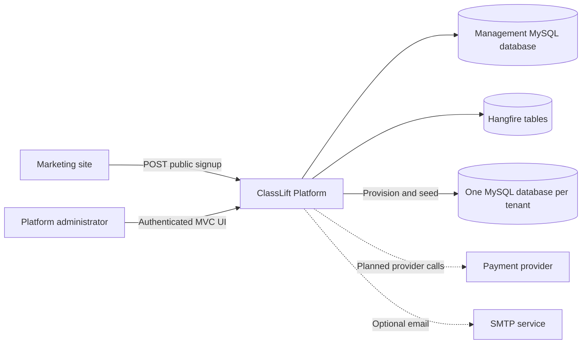
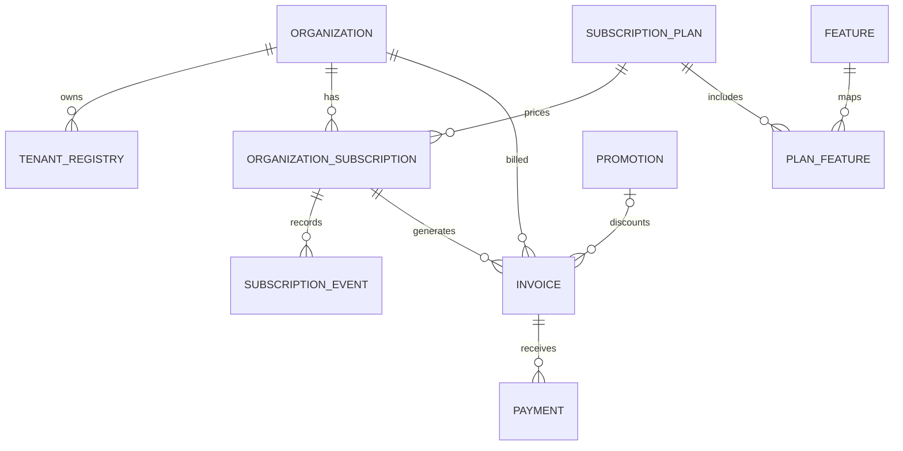

# ClassLift Platform: Project Guide

## Purpose

ClassLift Platform is the management plane for the ClassLift SaaS product. It
keeps commercial and operational data in a central database while isolating each
customer's application data in a dedicated tenant database.

Its current responsibilities are:

- onboard organizations and provision their tenant databases;
- manage plans, prices, promotions, and plan features;
- track trials and subscription changes;
- generate recurring and prorated invoices;
- record payments and identify overdue invoices;
- expose an authenticated administration portal; and
- execute recurring billing work with an audit trail.

The repository contains only the management/billing application. The tenant
application whose schema is copied from `Billing/TenantScripts` is not otherwise
implemented here.

## System context



Dashed relationships are incomplete or not enabled in the current code.

## Architecture

The application is a conventional server-rendered ASP.NET Core MVC application.
`Billing/Program.cs` acts as the composition root and configures Identity, EF
Core, Hangfire, CORS, localization, middleware, services, and recurring jobs.

### Presentation layer

- `Controllers/` contains the authenticated management endpoints.
- `Controllers/Public/` contains the anonymous JSON signup endpoint.
- `Views/` contains the Bootstrap-based management interface.
- `ViewModels/` shapes form and dashboard data.
- Authentication is globally required through an MVC authorization filter;
  explicitly anonymous actions opt out.

### Application and domain services

- `Services/Billing/` owns invoices, payments, plans, subscriptions, feature
  access, dunning, and billing-run records.
- `Services/Provisioning/` owns database creation, SQL initialization, tenant
  registration, and tenant Identity seeding.
- `Services/Jobs/` provides the Hangfire entry points.
- `Services/Notifications/` and `Services/Integrations/` are intended adapters
  for external systems; several are currently placeholders.

### Persistence

`BillingDbContext` is both the management domain context and the ASP.NET Core
Identity context. It maps:

- organizations and tenant registry entries;
- subscription plans and plan features;
- organization subscriptions and subscription events;
- promotions, invoices, and payments; and
- billing-run execution records.

`ManagementDBContext` targets a tenant database while seeding its initial user
and roles. Tenant schemas are installed from alphabetically ordered SQL files and
tracked in each tenant's `__TenantSchemaMigrations` table.

### Infrastructure

- MySQL is used for management data, tenant data, Identity, and Hangfire.
- The deployment image is built with the .NET 8 SDK image and runs on the .NET 8
  ASP.NET runtime image.
- The service binds to `PORT`, defaulting to `8080`.
- Culture and UI culture are fixed to `en-CA`.
- CORS permits the ClassLift development, staging, and production marketing
  origins.

## Core domain model



The subscription stores a snapshot of the plan's per-coach and minimum prices.
This preserves its agreed pricing when the plan definition changes.

## Key workflows

### Public tenant signup

`POST /api/public/signup` accepts the organization, subdomain, administrator,
password, and plan. The application then:

1. verifies that the selected plan is active and the organization name is new;
2. inserts the organization in the management database;
3. derives a sanitized `classlift_<subdomain>` database name;
4. creates the tenant database and applies tenant SQL scripts;
5. creates the tenant registry and a 30-day trial subscription;
6. records a trial-started subscription event;
7. creates tenant roles and the first administrator; and
8. returns a development, staging, or production tenant login URL based on the
   request host.

The management writes use a database transaction. Tenant database creation is an
external side effect and is not automatically compensated if a later operation
fails.

### Billing

When a trial expires, it becomes active and receives a prorated invoice through
the end of the current month. Recurring billing generates one invoice per active
subscription and month. A unique database index and an application check protect
against duplicate billing periods.

Invoice totals are calculated as:

```text
monthly usage charge = coach count * price per coach
proration ratio      = used days / days in month
invoice total        = max(prorated usage charge, prorated minimum charge)
due date             = billing period end + 15 days
```

The current implementation uses a placeholder coach count of `1`; tenant usage
is not yet queried. Promotions exist in the model but are not applied during
invoice calculation.

### Payments and dunning

`PaymentService` records a successful full payment and marks the invoice paid.
Partial payments are rejected. This is currently an administrative record rather
than a payment-provider transaction. Dunning changes past-due pending invoices
to overdue.

### Feature access

Features are assigned to plans through `Planfeature`. `FeatureAccessService`
loads and caches an organization's effective feature context. The cache must be
cleared when relevant plan assignments change.

## Recurring operations

Schedules are registered at application startup using Eastern Standard Time:

| Hangfire identifier | Cron | Operation |
|---|---|---|
| `daily-dunning` | `0 2 * * *` | Mark overdue invoices |
| `daily-billing` | `30 2 * * *` | End trials and mark overdue invoices |
| `monthly-billing` | `0 2 1 * *` | Generate monthly invoices |

Daily and monthly billing executions create `BillingRun` records with counts,
duration, status, and error information. The standalone dunning job currently
does not create a billing-run record.

## Environments and configuration

Configuration follows standard ASP.NET Core precedence. Environment variable
names use double underscores, for example `TenantDatabase__Password`.

| Area | Keys |
|---|---|
| MySQL | `TenantDatabase:Host`, `Port`, `User`, `Password` |
| SMTP | `SmtpSettings:Host`, `Port`, `Username`, `Password`, `FromEmail`, `FromName`, `EnableSsl` |
| HTTP | `PORT` |

The management connection string is assembled for the fixed database name
`classlift_platform`. The same server credentials are used to create and connect
to tenant databases, so the configured database account currently requires broad
privileges.

Tenant URLs are derived as follows:

| Request host | Returned tenant host |
|---|---|
| starts with `dev.` | `<tenant>.dev.classlift.ca` |
| starts with `staging.` | `<tenant>.staging.classlift.ca` |
| anything else | `<tenant>.classlift.ca` |

## Current implementation status

### Implemented

- Management authentication with ASP.NET Core Identity
- Organization and tenant provisioning
- Tenant schema tracking and initial role/admin seeding
- Plan and feature administration
- Trial and subscription event tracking
- Prorated and monthly invoice generation
- Full-payment recording and invoice status updates
- Dunning and Hangfire scheduling
- Management dashboards and detail views
- Docker build and runtime definition

### Partial or placeholder

- Stripe/payment-provider processing
- OpenAI and Railway webhooks
- SMS and generic webhook notifications
- Refund and promotion behavior
- Welcome email invocation
- Live tenant coach-count/usage retrieval
- Tenant resolution middleware
- Reporting services

## Known risks and technical debt

These items are observations about the current code, not guarantees that every
deployment is affected.

### Critical before production

1. **Remove predictable administrator bootstrapping.** Startup currently creates
   a fixed management user with a hard-coded password. Replace it with an
   explicit, one-time, secret-driven bootstrap process.
2. **Rotate and externalize secrets.** Treat any credentials previously committed
   in `appsettings*.json` as exposed. Store production secrets in the deployment
   platform's secret manager.
3. **Align database enums with domain constants.** The mapped subscription status
   enum omits `Trial` and `Suspended`, while the application writes those values.
   Subscription event mappings also omit the trial event names written by the
   application.
4. **Add authorization roles/policies.** Global authentication does not by itself
   distinguish platform administrators from other authenticated users.
5. **Enforce request protection.** Review every state-changing MVC action for
   antiforgery enforcement and secure the public signup API with validation,
   throttling, abuse protection, and explicit subdomain uniqueness rules.

### Reliability and correctness

1. Add compensation or a durable provisioning workflow so a failed signup does
   not leave an orphan tenant database or partially provisioned organization.
2. Replace semicolon-based SQL splitting with a migration mechanism that safely
   handles complex MySQL scripts, strings, procedures, and triggers.
3. Source coach counts from tenant usage and define the billing snapshot time.
4. Make payment-provider transaction IDs unique and processing idempotent before
   accepting webhooks.
5. Clarify plan changes during trials; the current plan-change query looks only
   for an active subscription.
6. Ensure job failure paths persist failed `BillingRun` state consistently.
7. Review time-zone behavior: schedules use Eastern time while billing data is
   mostly recorded in UTC.

### Maintainability

1. Add automated unit, integration, and provisioning tests.
2. Replace generic `Exception` usage with domain-specific failures and consistent
   API/UI error handling.
3. Remove unused controllers, empty services, commented code, and scaffolded
   Razor Pages that are not part of the application.
4. Add structured health checks and observability for MySQL, Hangfire, SMTP, and
   tenant provisioning.
5. Establish a repeatable management-database migration and deployment process.

## Recommended roadmap

### Phase 1: secure and stabilize

- Rotate credentials and move secrets out of tracked configuration.
- Replace startup admin creation with controlled bootstrap tooling.
- Fix subscription and event schema mismatches.
- Add platform administrator authorization and antiforgery enforcement.
- Validate and rate-limit public signup.
- Add CI that restores, builds, and runs tests.

### Phase 2: make billing trustworthy

- Add tests for full-month, prorated, minimum-price, duplicate, and boundary-date
  calculations.
- Integrate authoritative tenant coach counts.
- Define plan-change billing and trial-change behavior.
- Implement idempotent payment webhooks and refunds.
- Apply promotions and document accounting rules.

### Phase 3: harden provisioning and operations

- Convert provisioning into resumable, observable steps with compensation.
- Replace the SQL dump runner with versioned tenant migrations.
- Add health checks, alerting, structured logs, and failed-job procedures.
- Exercise backup, tenant restore, and disaster-recovery workflows.
- Document development, staging, and production deployment ownership.

## Development conventions

- Keep controllers thin and put business rules in services.
- Use UTC for stored timestamps and make billing-boundary conversions explicit.
- Use constants or value types consistently for statuses and event names.
- Make externally triggered operations idempotent.
- Never log passwords, connection strings, payment data, or signup passwords.
- Add a migration and tests whenever persistent behavior changes.
- Preserve tenant isolation: never accept a tenant database name directly from an
  untrusted request.

## Definition of production readiness

At minimum, production readiness means:

- no committed or hard-coded credentials;
- role-based management authorization and protected write operations;
- validated signup with duplicate and abuse controls;
- domain constants and database constraints agree;
- billing and provisioning have automated test coverage;
- external payment processing is verified and idempotent;
- migrations, backups, recovery, monitoring, and job-failure procedures are
  documented and rehearsed; and
- a clean release build succeeds in CI.
